# 28 Best Antivirus Software Tools in 2025

Cybersecurity threats evolve every hour, with ransomware attacks targeting small businesses, phishing schemes draining bank accounts, and zero-day exploits slipping past outdated protection systems. Traditional antivirus software has transformed into comprehensive security suites offering real-time malware detection, firewall protection, VPN services, and dark web monitoring—all designed to keep your devices safe without slowing them down. Whether you need free basic protection or premium enterprise-grade security across multiple devices, modern antivirus platforms deliver powerful defense mechanisms that catch threats before they compromise your personal data, financial information, or business operations.

***

## **[AVG](https://www.avg.com)**

A trusted free and premium antivirus solution delivering comprehensive malware protection with advanced firewall capabilities and minimal system impact.

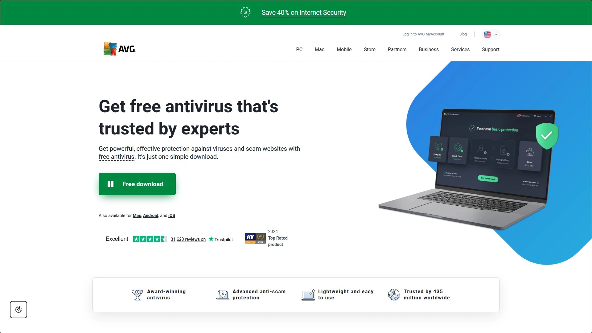

AVG has protected millions of devices worldwide since its launch, offering both free and paid versions that detect viruses, spyware, ransomware, and phishing attacks in real-time. The free version includes features typically reserved for premium programs like scheduled scans and advanced threat protection, making it an exceptional value for budget-conscious users.

One standout feature is AVG's enhanced firewall, considered among the best in 2025. It monitors inbound and outbound network traffic with four handling modes: Smart mode automatically determines app trustworthiness, Block prevents internet access entirely, Allow grants automatic connections, and Ask prompts user decisions for each app. The firewall provides leak protection, port scanning, ARP spoofing alerts, and complete customization options that work seamlessly in the background.

AVG performed exceptionally well in independent testing, achieving perfect malware detection rates and near-perfect protection scores with minimal false positives. The software includes web shield protection, email security, and privacy tools that block suspicious websites and infected downloads before they reach your system. Business editions add central management consoles, allowing IT administrators to deploy updates, configure security policies, and schedule scans across all company devices remotely.

The interface remains intuitive and user-friendly, making it accessible for both technical and non-technical users. AVG's lightweight design ensures scans run efficiently without consuming excessive CPU resources or slowing computer performance during active use. Premium versions unlock additional features like enhanced ransomware protection, secure VPN for encrypted browsing, and AntiTrack technology that prevents websites from collecting your digital fingerprint.

***

## **[Norton 360](https://norton.com)**

Industry-leading security suite backed by a 100% virus protection promise with comprehensive features including VPN, dark web monitoring, and parental controls.

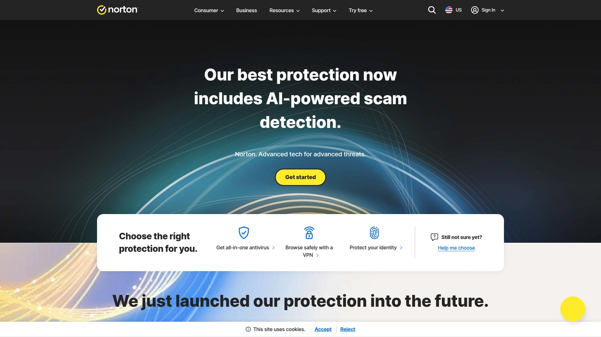

Norton consistently earns top ratings from independent testing labs like AV-TEST, AV-Comparatives, and SE Labs, demonstrating reliable malware detection across all operating systems. The platform protects against viruses, malware, ransomware, and sophisticated hacking attempts while maintaining excellent performance without draining device resources.

Genie Scam Protection uses AI-powered analysis to detect phishing attempts in emails, text messages, and social media before you click malicious links. This feature learns from thousands of new threats daily, delivering instant risk assessments in plain language that anyone can understand. Norton Password Manager syncs securely across browsers and devices with autofill capabilities, vault analysis, and password generation—all included without extra fees.

The security suite includes Norton Secure VPN for private browsing, comprehensive dark web monitoring that alerts you when personal information appears in data breaches, and robust parental controls for managing children's device usage. Higher-tier plans unlock cloud backup storage and protection for unlimited devices. Norton's 60-day money-back guarantee provides ample time to test the full feature set risk-free.

Norton Family delivers detailed parental control options across devices, allowing parents to monitor web access, filter search terms, set screen time limits, and review comprehensive activity reports. Real-time protection continuously scans files, downloads, and system processes to catch threats immediately.

***

## **[Bitdefender](https://bitdefender.com)**

Premium antivirus software with near-perfect detection rates and minimal performance impact, consistently ranking as the top choice among security experts.

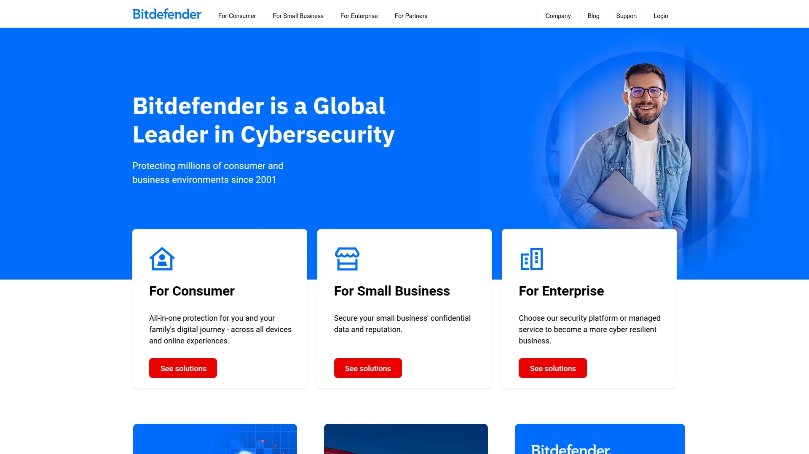

Bitdefender earned the highest scores from independent testing organizations, achieving exceptional results in protection, performance, and usability categories. The platform uses advanced machine learning and behavioral analysis to identify and neutralize threats before they execute, providing proactive defense against zero-day attacks.

The antivirus engine operates efficiently in the background, scanning files and monitoring processes with remarkably low CPU utilization compared to competitors. This lightweight approach ensures your computer maintains speed during full system scans and real-time protection monitoring. Bitdefender includes comprehensive ransomware protection, secure banking features, and anti-phishing tools that block fraudulent websites.

Premium plans bundle VPN service with unlimited data, password manager functionality, file shredder for permanent deletion, and webcam protection that prevents unauthorized access. The multi-layered security approach combines traditional signature-based detection with advanced heuristic analysis and cloud-powered threat intelligence.

Bitdefender's centralized dashboard simplifies security management across multiple devices, displaying protection status, threat history, and optimization recommendations at a glance. Automated scans run during idle periods to minimize disruption, while customizable settings let advanced users fine-tune protection levels.

***

## **[Kaspersky](https://kaspersky.com)**

Feature-rich security suite offering extensive configuration options, solid malware detection, and tools like VPN, password manager, and parental controls.

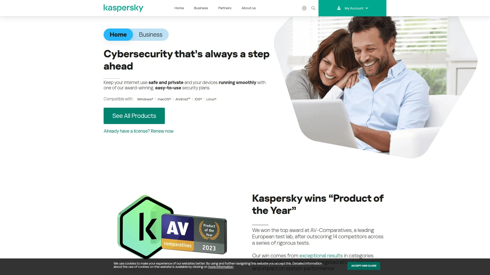

Kaspersky provides an overabundance of features including customizable scanning options, ransomware protection, web filtering, email security, webcam monitoring, firewall management, ad blocking, and secure browser functionality. The platform scored top marks in independent laboratory testing, earning Advanced+ awards from AV-Comparatives and AAA ratings from SE Labs.

The software excels in detecting known threats while using heuristic analysis to identify malware-like behavior patterns for catching emerging threats. Users can configure virtually every security aspect to match their specific needs, from real-time scanning sensitivity to network monitoring rules. Additional tools include file shredder for secure deletion, instant messaging protection, and GPS tracking within parental control features.

Kaspersky combines strong protection with excellent performance optimization, maintaining system speed during scans and background monitoring. The interface remains user-friendly despite the extensive feature set, organizing tools logically for quick access. Premium packages include VPN service based on proven technology and cloud backup for protecting important files.

***

## **[McAfee Total Protection](https://mcafee.com)**

Comprehensive antivirus platform protecting unlimited devices with identity monitoring, secure VPN, and unique file shredder capabilities.

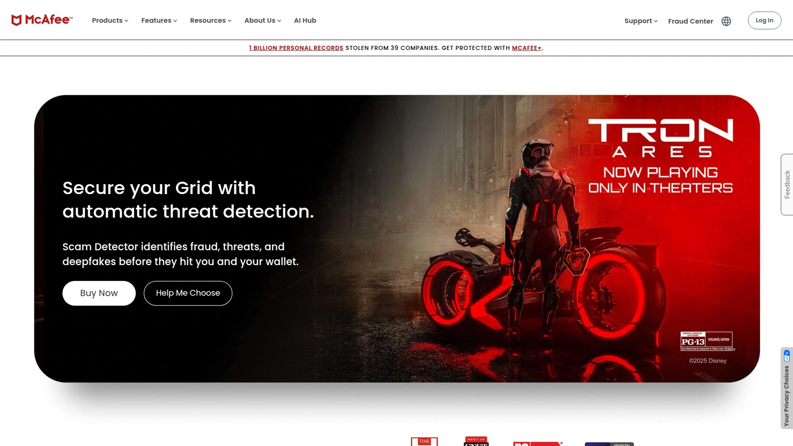

McAfee earned Top Product certification from AV-TEST and achieved 99% protection scores in SE Labs testing, demonstrating reliable security performance. The platform caught all malware samples during hands-on testing while maintaining reasonable system resource usage. Real-time protection monitors files continuously, blocking threats immediately upon detection.

The security suite includes identity theft protection that monitors personal information across the dark web, alerting you when credentials appear in data breaches. File shredder permanently deletes sensitive documents, preventing recovery tools from accessing deleted data. McAfee's True Key password manager uses multi-factor authentication including biometric options for enhanced security.

Parental controls let parents monitor device activity, check location, set time restrictions, and block inappropriate apps or websites with customizable rules. The platform offers longer free trials than most competitors and includes a money-back guarantee for testing without commitment. McAfee Total Protection covers unlimited devices across Windows, macOS, iOS, and Android platforms under a single subscription.

***

## **[Avast One](https://avast.com)**

Powerful free antivirus with premium upgrades, featuring sandbox testing environment, customizable firewall, and extensive configuration options.

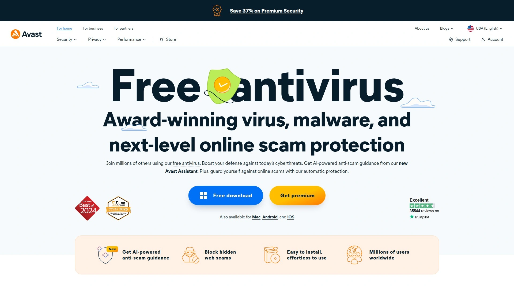

Avast provides generous free protection trusted by over 400 million users worldwide, including real-time malware detection, web shield filtering, and email scanning. The software achieved top ratings from testing laboratories with perfect security scores and Advanced+ awards. Premium versions unlock firewall customization, Wi-Fi Inspector for network security, and data shredder for permanent file deletion.

The unique Sandbox tool allows users to test suspicious applications in isolated environments where programs have limited access to system files and data. This feature proves invaluable when evaluating unknown software or opening questionable downloads without risking infection. Avast's real-time protection continuously scans files when opened, modified, or saved.

Additional features include secure browser with integrated ad blocking, password manager, and VPN service available through separate subscription. The interface offers detailed settings and configuration options for users who want granular control over protection behavior. Avast balances comprehensive features with user-friendly design, making advanced security accessible.

***

## **[ESET Internet Security](https://eset.com)**

Lightweight antivirus platform known for excellent detection rates, minimal system impact, and advanced threat intelligence capabilities.

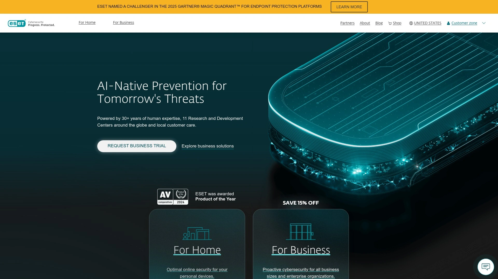

ESET consistently achieves near-perfect protection scores while maintaining exceptionally low CPU utilization during scans and real-time monitoring. The software uses multi-layered security combining machine learning, heuristic analysis, and cloud-based threat intelligence to identify malware before execution.

The platform provides comprehensive protection against viruses, ransomware, spyware, and phishing attempts without slowing computer performance. ESET includes banking and payment protection that secures financial transactions, network inspector for identifying vulnerabilities, and anti-theft features for locating lost devices. Customizable scanning options let users schedule full system checks during off-hours or perform quick scans for faster results.

Advanced users appreciate ESET's detailed configuration settings that provide granular control over security policies and scanning behavior. The clean interface organizes features logically, making navigation intuitive even with extensive capabilities. Regular updates ensure protection against the latest threats through cloud-connected signature databases.

***

## **[Malwarebytes Premium](https://malwarebytes.com)**

Specialized anti-malware solution detecting threats traditional antivirus programs miss, ideal for supplementing existing security or standalone protection.

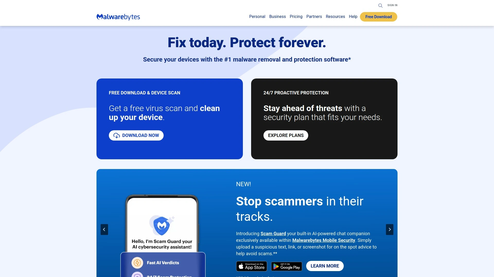

Malwarebytes achieved perfect protection scores in independent testing while focusing specifically on malware, ransomware, and exploit detection. The platform uses advanced heuristics and behavior monitoring to catch sophisticated threats that signature-based scanners overlook. Real-time protection continuously analyzes running processes, blocking malicious activity before damage occurs.

The software excels at detecting low-profile threats in sensitive environments like healthcare and finance where data protection remains critical. Many security professionals deploy Malwarebytes alongside traditional antivirus for layered defense, adding specialized malware hunting capabilities. The lightweight design minimizes system resource consumption during scans.

Malwarebytes includes web protection blocking access to malicious websites, exploit protection preventing vulnerability attacks, and ransomware protection monitoring file encryption attempts. The straightforward interface makes operation simple for non-technical users while providing detailed threat reports for review. Premium subscriptions unlock real-time protection and automated scanning compared to the free on-demand scanner.

---

## **[Trend Micro Maximum Security](https://trendmicro.com)**

Feature-packed security suite with parental controls, social media privacy protection, and comprehensive defense against modern cyber threats.

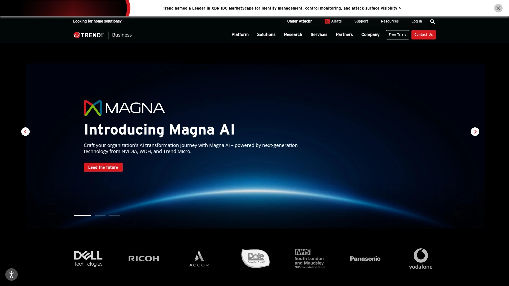

Trend Micro earned Top Product certification from AV-TEST, scoring full marks across protection, performance, and usability categories. The platform achieved AAA ranking from SE Labs and Advanced award from AV-Comparatives, demonstrating consistent high-quality protection. Real-time scanning monitors file activity continuously, checking for security risks whenever files are received, opened, downloaded, copied, or modified.

The security suite provides multi-layer malware protection starting with known threat signatures before moving to heuristic analysis for identifying behavior patterns of unfamiliar malware. Dedicated defenses target specific threats including fileless malware, tech-support scams, phishing attacks, cryptocurrency-mining malware, and keylogging programs. Banking and payment protection secures financial transactions while social media privacy tools prevent data collection from popular platforms.

Trend Micro includes comprehensive parental controls with content filtering, screen time management, and activity monitoring across devices. The built-in VPN encrypts internet traffic for private browsing, while password manager securely stores credentials with autofill functionality. Webcam protection blocks unauthorized access attempts to connected cameras.

***

## **[Windows Defender](https://microsoft.com)**

Built-in Windows security solution providing robust protection without additional cost, continually improving to match paid antivirus capabilities.

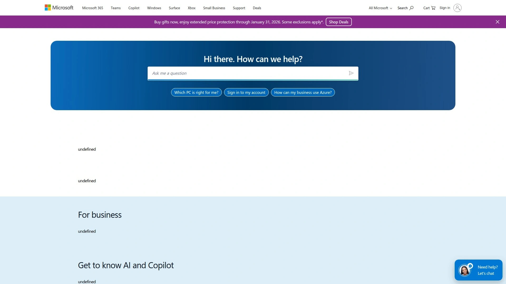

Windows Defender (now Microsoft Security) delivers full security suite functionality comparable to paid third-party antivirus programs, earning high ratings from independent testing labs. The platform achieved near-perfect protection scores with low false positive rates in AV-Comparatives testing. Real-time protection monitors system activity continuously, scanning files and blocking threats automatically.

The security solution integrates seamlessly with Windows operating systems, requiring no additional installation or configuration for basic protection. Updates arrive automatically through Windows Update, ensuring current protection against latest threats. Windows Defender includes firewall management, browser security features, and device performance optimization tools.

Advanced features like controlled folder access prevent ransomware from modifying protected directories, while SmartScreen filters malicious websites and downloads. The platform runs efficiently without consuming excessive system resources, maintaining computer performance during background scanning. Windows Defender works well for users wanting reliable protection without subscription fees.

***

## **[Webroot SecureAnywhere](https://webroot.com)**

Cloud-based antivirus with remarkably fast scanning speeds, minimal storage footprint, and low CPU utilization for resource-constrained systems.

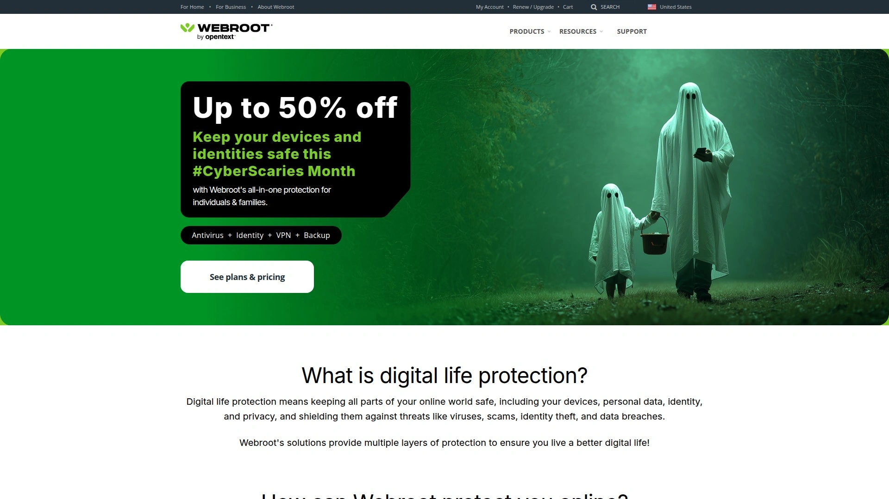

Webroot completes quick scans in approximately one second with CPU utilization peaking at just 31 percent, demonstrating exceptional speed and efficiency. The cloud-based architecture keeps the local installation tiny, requiring minimal disk space compared to traditional antivirus programs. This lightweight approach suits older computers or systems with limited hardware resources.

The platform monitors system activity continuously, uploading suspicious files to cloud servers for analysis against constantly updated threat databases. Real-time protection identifies and blocks malware before execution using behavioral analysis and threat intelligence. Webroot includes identity protection services and secure browsing features that warn about dangerous websites.

The cloud-connected design allows rapid updates without requiring large signature database downloads, keeping protection current against emerging threats. Full system scans complete in approximately 72 minutes while providing thorough coverage. Webroot works effectively on both personal computers and business networks.

***

## **[Sophos Home Premium](https://sophos.com)**

Business-grade protection adapted for home users, featuring remote management capabilities and parental controls with privacy-focused design.

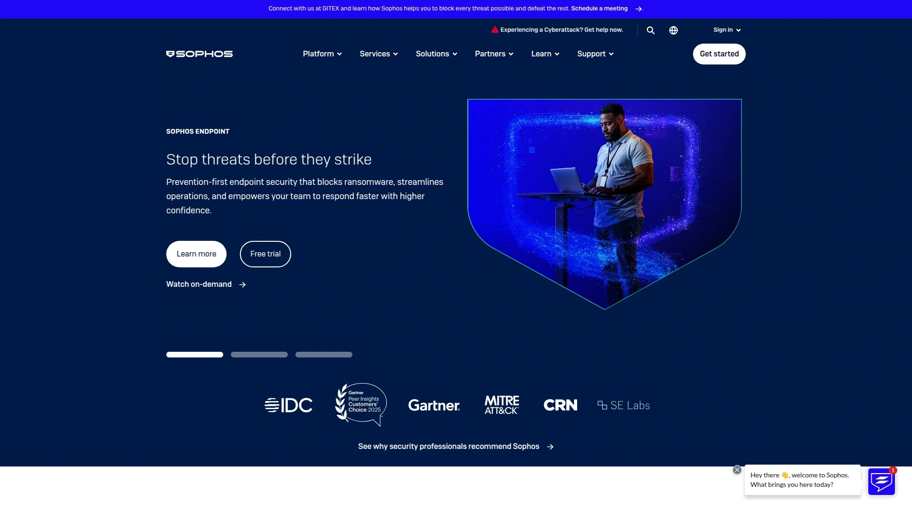

Sophos achieved 99.5% protection rate in AV-Comparatives business security testing, demonstrating enterprise-level threat detection. The platform aims to provide identical protection quality for both business and home users, bringing corporate security standards to residential environments. Real-time scanning monitors files continuously while behavioral analysis detects suspicious activity.

Full system scans complete in approximately 15 minutes, significantly faster than many competitors while maintaining thorough coverage. CPU utilization during scanning remains reasonable, though higher than some lightweight alternatives. Sophos includes web filtering to block malicious sites, application control for managing program behavior, and ransomware protection.

The remote management console lets parents or administrators monitor and configure security settings across multiple devices from web browsers. This feature proves valuable for managing family devices or providing tech support remotely. Sophos emphasizes privacy protection alongside malware defense, avoiding data collection practices common among free antivirus programs.

***

## **[TotalAV](https://totalav.com)**

User-friendly security suite with improved billing transparency, dark web monitoring, and comprehensive system optimization tools for all experience levels.

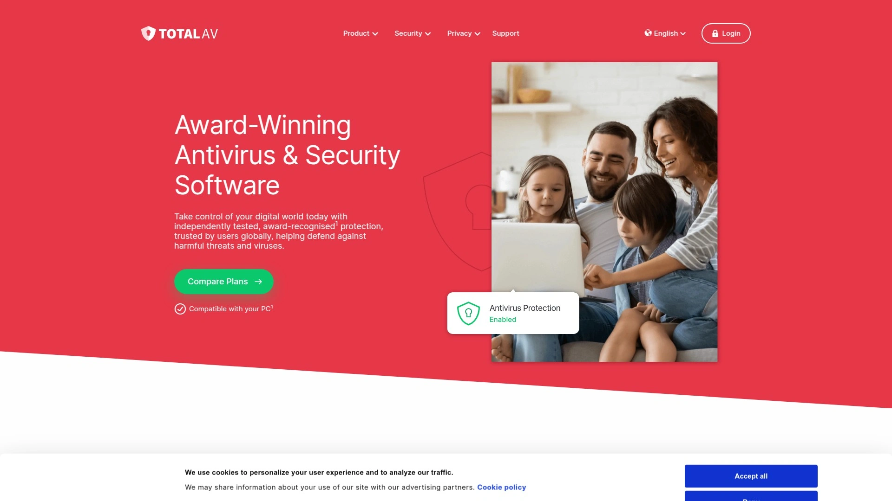

TotalAV has transformed significantly in recent years, responding to customer feedback by overhauling app functionality, design, and billing practices. The platform achieved strong protection scores (91.6) and perfect marks for low false positives in comprehensive testing. Real-time scanning provides high-grade malware detection while additional protections target phishing, ransomware, adware, and spyware.

The security suite includes Safe Browser VPN, system optimization tools for improving computer speed, password manager, and dark web monitoring that alerts when personal information appears in breaches. All tier levels provide 24/7 live chat support, making assistance readily available when needed. The interface ranks among the most user-friendly tested, with intuitive navigation suitable for beginners.

TotalAV launched in 2016, making it younger than Norton or McAfee, yet has rapidly established strong market presence through continuous improvements. The platform covers Windows, macOS, Android, and iOS devices with plans scaling from five devices up to eight depending on subscription tier. Advanced plans unlock VPN service and password manager alongside core antivirus protection.

***

## **[Panda Dome](https://pandasecurity.com)**

Cloud-based antivirus with unique features including physical theft protection, external hardware scanning, and virtual keyboard for bypassing keyloggers.

Panda achieved 100% malware detection in hands-on testing, successfully identifying all threats while occasionally generating false positives that quarantine legitimate files. The platform protects against comprehensive cyberthreats including ransomware, offering external hardware scans for USB drives and portable devices. WiFi protection alerts users about unsecured networks that could expose data.

Unique anti-theft features include remote device location tracking and automatic photo capture from front-facing cameras after three failed login attempts. The virtual keyboard prevents keyloggers from capturing passwords and sensitive information during data entry. Data shield protects specific file extensions from ransomware attacks, preventing encryption of critical documents.

Panda includes free VPN service with data limits, customizable firewall, and parental controls for managing children's online activity. The cloud-based architecture processes most analysis on remote servers, reducing local system resource requirements. AI and data analytics enhance malware detection and removal processes.

***

## **[Avira Prime](https://avira.com)**

German-engineered antivirus achieving perfect protection rates with comprehensive privacy tools and password management across multiple devices.

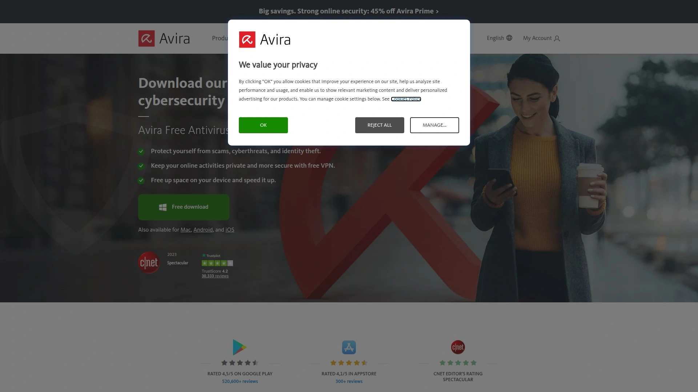

Avira achieved perfect malware protection and low false positive rates in AV-Comparatives testing, earning Advanced+ award recognition. The platform uses advanced detection engines combining signature-based scanning with behavioral analysis for catching both known and emerging threats. Real-time protection monitors system activity continuously, blocking malware before execution.

The security suite includes privacy tools that prevent tracking, password manager for secure credential storage, and system optimization utilities. VPN service encrypts internet traffic for anonymous browsing, while software updater identifies outdated programs that could contain vulnerabilities. The lightweight design maintains computer performance during background scanning.

Avira's German engineering emphasizes privacy protection alongside malware defense, avoiding questionable data collection practices. The platform covers Windows, macOS, Android, and iOS devices with straightforward installation and configuration. Regular updates ensure protection against latest threats through cloud-connected databases.

---

## **[G Data Total Security](https://gdata.de)**

Dual-engine antivirus combining multiple scanning technologies for thorough threat detection with comprehensive internet security features.

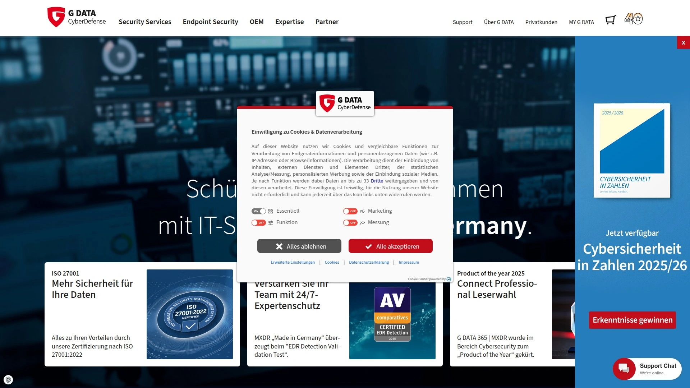

G Data uses dual-engine technology that runs two separate antivirus engines simultaneously, providing redundant protection and catching threats either engine might miss individually. This approach achieves excellent detection rates in independent testing while maintaining reasonable system performance. Real-time protection monitors files continuously using both engines.

The platform includes comprehensive internet security features like firewall management, web filtering, email scanning, and banking protection for secure financial transactions. Parental controls allow managing children's device access and online activity. The software protects against viruses, Trojans, ransomware, spyware, and phishing attempts.

G Data provides anti-spam filtering, USB keyboard protection, and automatic cloud backup for important files. The interface organizes features logically despite the extensive capabilities, making navigation straightforward. Regular updates maintain current protection through multiple threat intelligence sources feeding both engines.

---

## **[Emsisoft Anti-Malware](https://emsisoft.com)**

Dual-engine security solution emphasizing privacy, lightweight performance, and next-generation threat detection for businesses and home users.

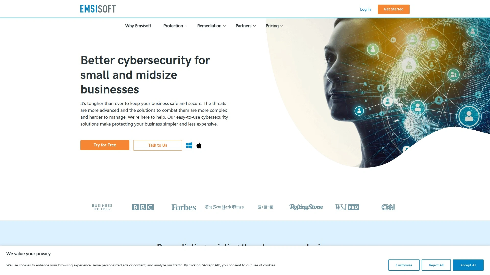

Emsisoft combines two powerful antivirus engines into one efficient scanner that detects and removes malware faster while using minimal hardware resources. The platform achieves award-winning threat detection using advanced smart cleaning technology that removes infections without damaging system files. Real-time File Guard checks all downloaded and modified files continuously.

Behavior Blocker continuously monitors active processes, intervening when suspicious activity appears. Anti-ransomware protection stops encryption attacks before they lock files, providing critical defense against this growing threat. Web protection blocks connections to malicious websites while respecting user privacy, unlike ad-supported alternatives.

The platform provides four-layer protection including safe web surfing, behavior blocker, real-time file guard, and dedicated anti-ransomware features. Emsisoft emphasizes easy deployment and management for businesses of all sizes while maintaining strong security. Certified removal experts provide personal assistance with specific threats when needed.

***

## **[Intego Mac Internet Security](https://intego.com)**

Mac-exclusive antivirus built specifically for macOS with powerful firewall, real-time protection, and native system compatibility.

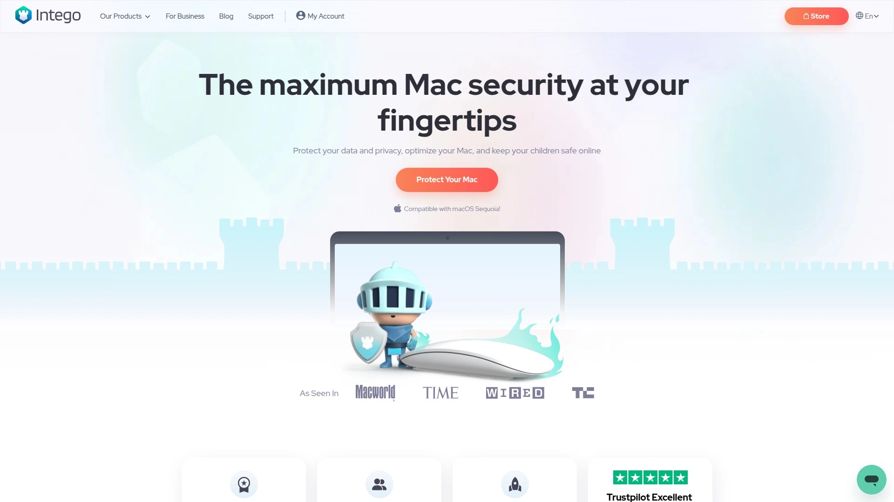

Intego focuses exclusively on Mac protection, delivering one of the most complete security packages available for Apple computers. VirusBarrier provides real-time antivirus and spyware detection certified by AV-Test for macOS malware defense. The advanced two-way firewall NetBarrier offers smart network filtering not found in most Mac antivirus tools.

The platform's long-standing Mac focus provides advantages in reliability and system compatibility compared to Windows-first security software adapted for macOS. Scheduled scans and automatic threat removal operate efficiently with minimal system impact. Protection extends to external drives and USB devices, scanning connected hardware for threats.

Intego includes anti-phishing and safe browsing tools that warn about dangerous websites. The animated firewall interface visualizes data flowing into and out of systems with color-coded arrows showing connection status. Unique capability allows scanning iPhones and iPads for malware when connected via USB cable. Optional bundles add parental controls, system cleaning, and backup tools.

***

## **[K7 Total Security](https://k7computing.com)**

Feature-rich antivirus from India offering comprehensive protection with strong detection rates and affordable pricing for emerging markets.

K7 achieved Advanced+ award from AV-Comparatives, demonstrating high-quality threat detection capabilities. The platform provides real-time protection against viruses, Trojans, ransomware, and spyware while maintaining reasonable system performance. Comprehensive scanning options allow customizing security checks based on specific needs.

The security suite includes firewall management, web filtering, email protection, and USB device scanning. Parental controls help manage children's online activity and device usage. K7 delivers solid protection at competitive pricing, making enterprise-grade security accessible for budget-conscious users.

Regular updates ensure current protection against emerging threats through cloud-connected signature databases. The platform covers Windows systems with straightforward installation and configuration. K7's focus on emerging markets brings advanced security features to regions often underserved by major vendors.

***

## **[Comodo Antivirus](https://comodo.com)**

Free security solution with sandbox technology, default-deny protection model, and comprehensive threat prevention for Windows systems.

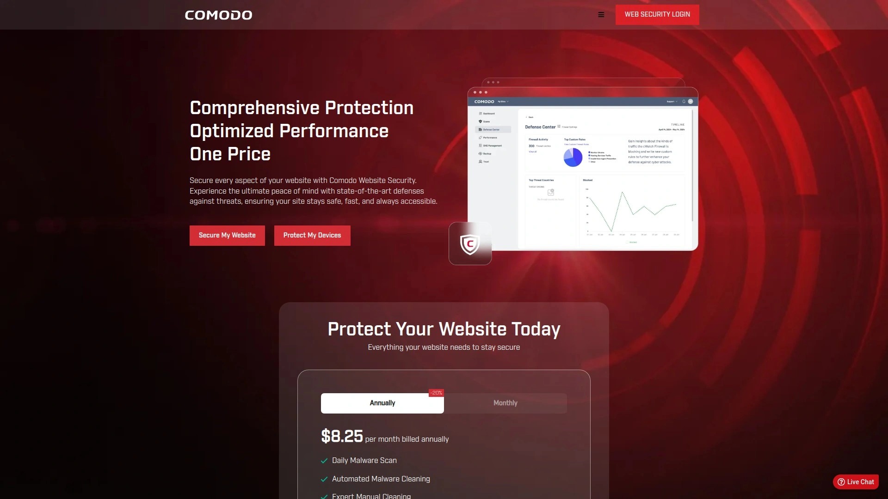

Comodo uses default-deny protection model that blocks unknown files until safety verification completes, providing proactive defense against zero-day threats. The platform includes sandbox technology allowing suspicious programs to run in isolated environments without risking system infection. This approach catches threats that signature-based and heuristic analysis might miss.

Real-time protection monitors system activity continuously, blocking known malware while sandboxing unfamiliar files for safe execution. The firewall provides advanced network protection with customizable rules for controlling application internet access. Comodo includes cloud-based analysis that uploads suspicious files for thorough examination.

The free version delivers substantial protection suitable for home users, while paid editions unlock additional features for business environments. Regular updates maintain current threat intelligence through cloud-connected databases. Comodo's unique security model complements traditional antivirus approaches.

***

## **[VIPRE Advanced Security](https://vipre.com)**

Lightweight antivirus with strong detection rates, minimal performance impact, and straightforward interface for essential protection without complexity.

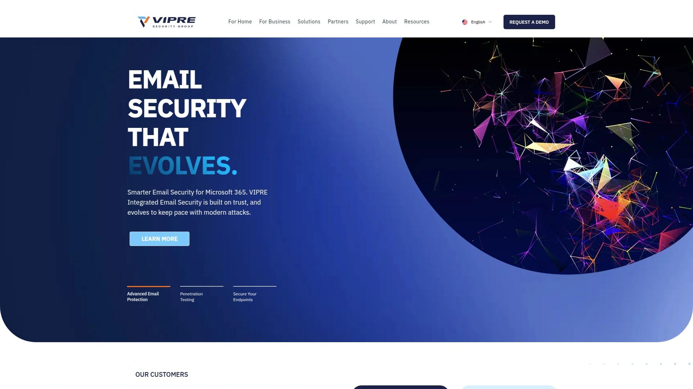

VIPRE achieved near-perfect protection and low false positive rates in AV-Comparatives testing, earning Advanced+ recognition. The platform provides essential protection against malware, viruses, ransomware, and phishing attacks without consuming excessive system resources. Real-time monitoring scans files continuously while maintaining computer performance.

The user-friendly interface emphasizes simplicity, making security accessible for non-technical users while providing necessary controls. VIPRE includes web filtering, email scanning, and firewall management organized through straightforward menus. Automatic updates ensure current protection without requiring manual intervention.

The lightweight design suits systems where performance matters, avoiding the resource drain of feature-heavy security suites. VIPRE covers essential protection needs without overwhelming users with unnecessary complexity. The platform works well for home users and small businesses seeking reliable security without extensive configuration.

***

## **[ZoneAlarm Extreme Security](https://zonealarm.com)**

Pioneer of personal firewall technology offering next-generation antivirus with advanced threat detection and zero-day protection.

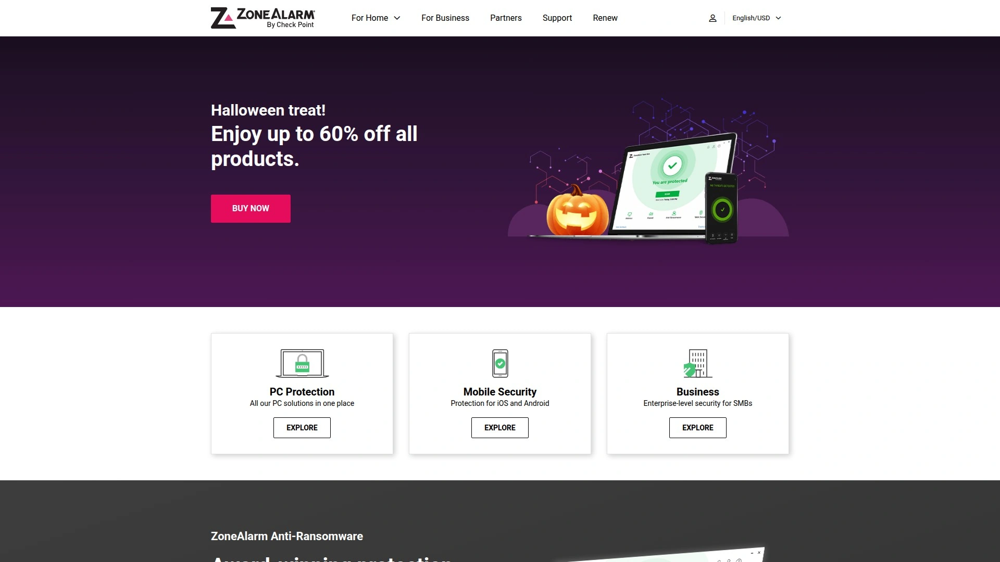

ZoneAlarm created the world's first personal firewall for home PCs, building decades of expertise in network security. The two-way firewall protects against inbound and outbound attacks, blocking intruders attempting entry while catching data theft attempts on exit. The platform makes PCs invisible to hackers through advanced network cloaking.

Next-generation antivirus engine uses machine learning technology for defending against zero-day threats that traditional signature-based scanning misses. Behavioral analysis monitors programs for suspicious activity, stopping new attacks that conventional protection can't catch. Anti-phishing protection identifies and blocks fraudulent websites using static, heuristic, and machine learning techniques.

ZoneAlarm includes anti-bot protection that identifies and neutralizes harmful bots providing real-time defense against botnet intrusion, spam, and data theft. Cloud-connected signature checking ensures files are verified against constantly updated threat databases. The platform offers 24/7 customer support through online help, forums, and comprehensive documentation.

***

## **[PC Matic](https://pcmatic.com)**

American-made antivirus using application allowlisting technology for preventing ransomware through default-deny security model.

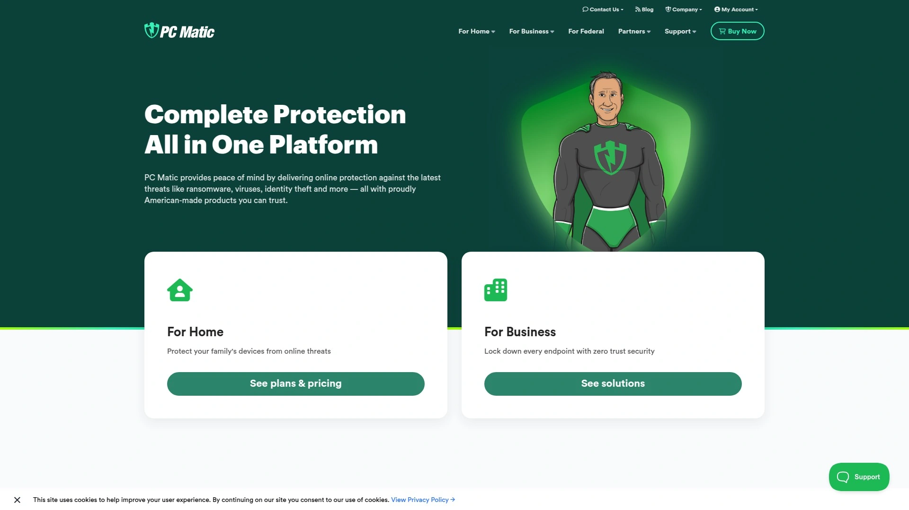

PC Matic takes a unique approach using superior allowlisting technology that only permits known-safe applications to execute, blocking everything else by default. This method provides strong ransomware prevention since malicious programs cannot run without explicit approval. The allowlisting model proves particularly effective against zero-day exploits and unknown threats.

The platform includes system optimization tools that improve computer performance alongside security protection. PC Matic emphasizes supporting American cybersecurity development with software engineered and supported domestically. The default-deny approach complements traditional signature-based antivirus by preventing execution rather than detecting after infection.

Regular updates maintain the allowlist with verified safe applications, expanding coverage while maintaining security. PC Matic suits users prioritizing ransomware protection and willing to approve new applications before first execution. The platform includes system tuning features that remove junk files and optimize settings.

***

## **[F-Secure SAFE](https://f-secure.com)**

Nordic security solution emphasizing privacy protection with banking security, parental controls, and comprehensive threat defense.

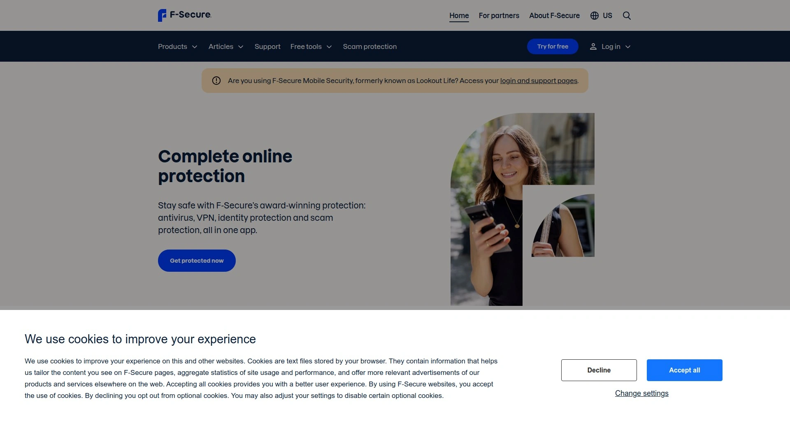

F-Secure provides comprehensive antivirus protection combined with privacy-focused features that prevent tracking and data collection. The platform uses advanced threat detection combining signature scanning, behavioral analysis, and cloud-powered intelligence for identifying malware. Real-time protection monitors system activity continuously.

Banking protection secures financial transactions by isolating browsers and preventing data interception during online banking sessions. Parental controls help manage children's device access with content filtering and usage limits. The clean interface simplifies security management while providing necessary controls.

F-Secure's Nordic engineering prioritizes privacy alongside security, avoiding questionable data practices common among free alternatives. The platform covers multiple devices across Windows, macOS, Android, and iOS with straightforward deployment. Regular updates maintain current protection through cloud-connected threat intelligence.

---

## **[SUPERAntiSpyware](https://superantispyware.com)**

Specialized anti-spyware tool detecting and removing tracking software, Trojans, dialers, and suspicious cookies that primary antivirus might overlook.

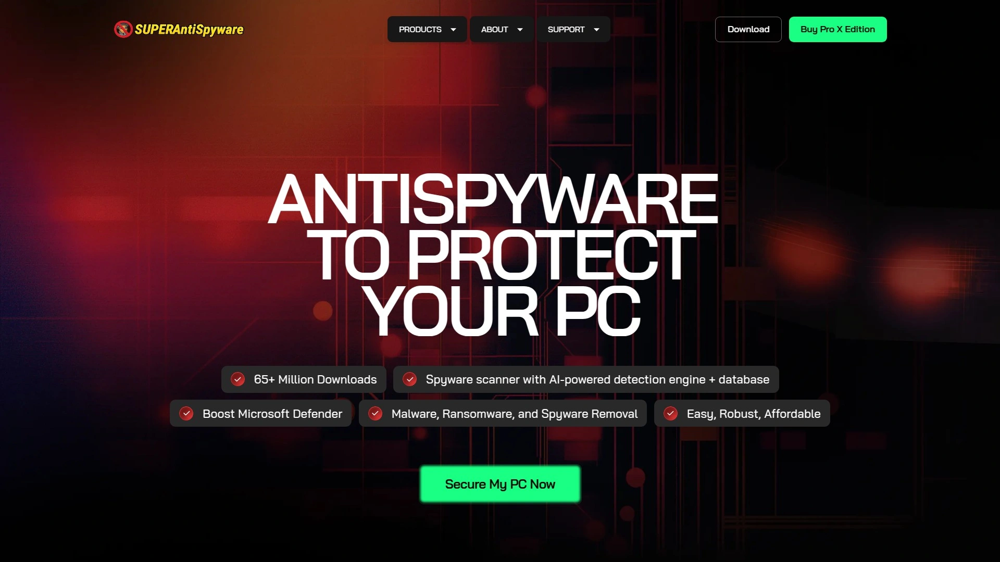

SUPERAntiSpyware focuses specifically on spyware detection and removal, catching threats that general-purpose antivirus programs sometimes miss. The platform scans memory, registry entries, and drives with customizable depth and speed settings. Scheduled scanning runs automatically in the background for continuous protection.

Users can adjust scanning speed from low to high based on available time and thoroughness requirements. The automatic quarantine system isolates suspicious files pending review while removing clear threats immediately. SUPERAntiSpyware detects Trojans, adware, dialers, suspicious cookies, and various spyware types.

The platform works well as supplemental protection alongside primary antivirus in sensitive environments like healthcare and finance where data protection remains critical. Industries handling confidential information deploy SUPERAntiSpyware for catching low-profile threats that typical scanners might overlook. Both free and paid versions available, with premium unlocking automatic updates and real-time protection.

***

## **[Quick Heal Total Security](https://quickheal.com)**

Indian antivirus provider offering comprehensive protection with strong malware detection and security features for home and business users.

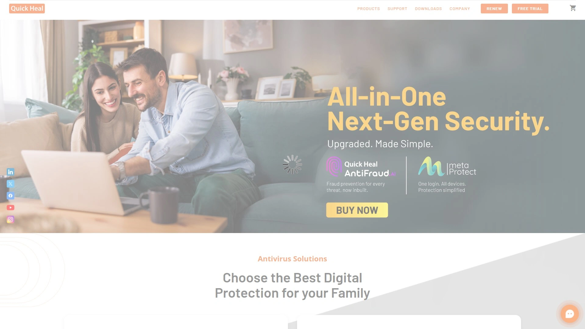

Quick Heal provides complete security solutions protecting against viruses, Trojans, malware, ransomware, and suspicious programs. The platform monitors web traffic, scans email attachments, and blocks access to dangerous websites automatically. Real-time protection operates continuously in the background.

The security suite includes firewall management, USB device scanning, email protection, and parental controls for managing children's online activity. Quick Heal achieves solid detection rates while maintaining reasonable system performance during scans. The straightforward interface makes operation accessible for users with varying technical expertise.

Regular updates ensure protection against latest threats through cloud-connected signature databases. Quick Heal serves markets across Asia with localized support and pricing appropriate for emerging economies. The platform covers Windows systems with comprehensive protection suitable for both home and small business use.

***

## **[Trellix Endpoint Security](https://trellix.com)**

Enterprise-focused security platform using AI-powered threat detection and response for comprehensive organizational protection.

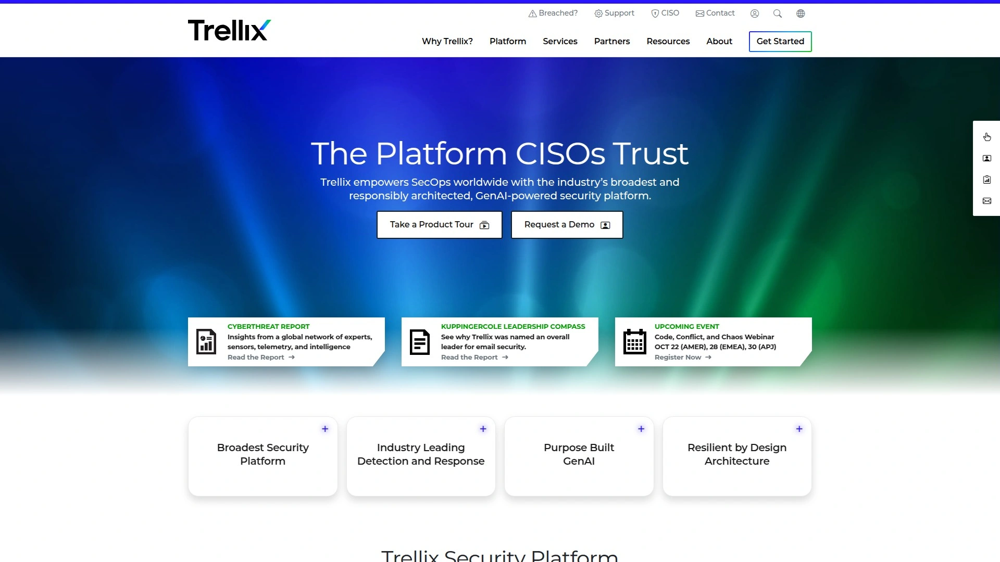

Trellix (formerly McAfee Enterprise) provides extensive detection and response capabilities powered by GenAI technology and over 10 years of AI modeling. The platform protects organizations with confidence through comprehensive monitoring and security solutions. Advanced threat detection identifies network intrusions, malware, and sophisticated attacks.

The AI-powered system adapts continuously, learning from threat patterns to improve detection accuracy. Trellix excels at providing comprehensive network threat detection and extensive all-inclusive response options. Organizations benefit from security decisions made daily based on massive threat intelligence databases.

Enterprise deployments suit larger organizations requiring centralized security management across many endpoints. Trellix integrates with existing security infrastructure for unified protection. The platform reduces SOC workload by automating triage, scoping, and assessment tasks.

***

## **[NANO Antivirus](https://nanoav.ru)**

Russian antivirus software emphasizing malware detection with cloud-based protection and real-time threat monitoring.

NANO Antivirus achieved strong malware detection scores, with reviewers praising its ability to identify and neutralize threats effectively. The platform monitors web traffic and checks email attachments for malicious content. Real-time protection scans files continuously as they are accessed or modified.

Cloud-based analysis supplements local scanning, uploading suspicious files to remote servers for comprehensive threat evaluation. The platform provides up-to-date protection against computer viruses, Trojans, malware, and suspicious programs. NANO Antivirus includes web filtering that blocks dangerous websites before they load.

Regular updates maintain current threat intelligence through cloud-connected databases. The platform covers Windows systems with straightforward installation and operation. NANO Antivirus serves users seeking reliable protection from lesser-known providers.

***

## **[Heimdal Endpoint Detection](https://heimdalsecurity.com)**

Advanced endpoint security emphasizing threat prevention through DNS filtering, dark web monitoring, and proactive vulnerability management.

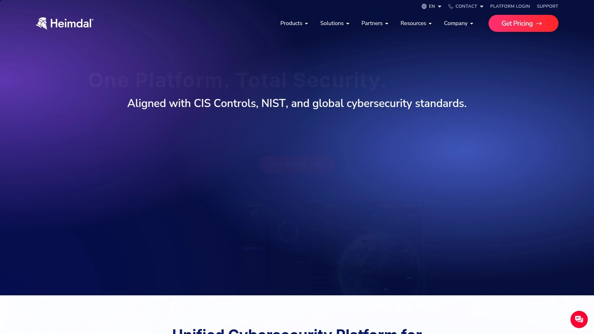

Heimdal focuses on preventing threats before they reach endpoints through advanced DNS filtering and threat intelligence. The platform provides endpoint detection and response capabilities that identify and neutralize sophisticated attacks. Behavioral analytics monitor system activity for suspicious patterns indicating compromise.

The security solution includes vulnerability scanning that identifies outdated software and missing patches requiring attention. Dark web monitoring alerts when organizational credentials appear in breach databases. Heimdal emphasizes proactive security through automated patching and configuration management.

Enterprise deployments benefit from centralized management consoles displaying security status across all endpoints. The platform integrates threat intelligence from multiple sources for comprehensive protection. Heimdal suits organizations seeking advanced security beyond traditional antivirus approaches.

***

## **[Acronis Cyber Protect](https://acronis.com)**

Integrated backup and cybersecurity platform combining antivirus protection with data recovery for complete cyber resilience.

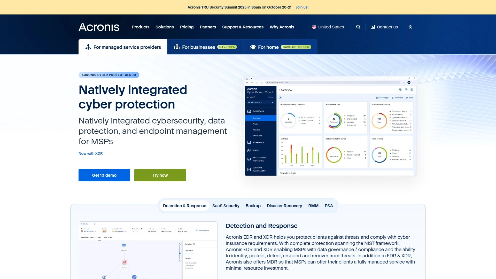

Acronis Cyber Protect merges backup and security into unified platform, providing both threat prevention and disaster recovery capabilities. Anti-malware protection uses AI-based static and behavioral heuristic analysis for defending against advanced cyberattacks in real-time. The platform protects against ransomware, viruses, and sophisticated malware.

Fail-safe patching automatically creates image backups before applying updates, eliminating risks of bad patches rendering systems unusable. Safe recovery prevents malware reinfection by automatically patching machines and scanning backup images with latest definitions before restoration. Continuous data protection safeguards critical information by backing up applications constantly.

Forensic backup capabilities collect digital evidence from disk-level backups for compliance management and internal investigations. MSPs benefit from centralized management for protecting multiple client environments. Acronis combines security and backup eliminating need for separate solutions.

***

## FAQ

**Which antivirus software provides the best free protection in 2025?**

AVG AntiVirus Free and Avast One Basic lead free antivirus options, both earning Editors' Choice recognition from PCMag for comprehensive protection without cost. Windows Defender also delivers robust built-in security that performs comparably to many paid solutions according to independent testing. These platforms provide real-time malware detection, scheduled scanning, and web protection suitable for basic security needs, though premium versions unlock additional features like VPN services, password managers, and priority customer support.

**How do I choose between Norton, Bitdefender, and Kaspersky for premium protection?**

Norton 360 excels in overall value with comprehensive features including VPN, dark web monitoring, and password manager bundled at competitive prices, backed by perfect protection scores and a 100% virus protection promise. Bitdefender achieves the highest independent testing scores with minimal performance impact, making it ideal for users prioritizing pure security effectiveness. Kaspersky offers the most extensive feature set with deep customization options, though some users may have concerns about its Russian origins despite excellent technical performance. Choose Norton for best overall package, Bitdefender for top-tier detection with minimal system impact, or Kaspersky for maximum features and configurability.

**Can antivirus software protect against ransomware and zero-day threats?**

Modern antivirus platforms use behavioral analysis, machine learning, and heuristic detection to identify ransomware and zero-day exploits before they execute, going beyond traditional signature-based scanning. Programs like Bitdefender, Norton, and Emsisoft include dedicated anti-ransomware features that monitor file encryption attempts and block suspicious behavior immediately. ZoneAlarm and PC Matic employ next-generation approaches using behavioral monitoring and application allowlisting to stop unknown threats that traditional antivirus might miss. Enable real-time protection and keep software updated to maximize defense against emerging threats, and consider platforms with automatic cloud-based analysis for fastest response to new attack methods.

---

## Conclusion

Cybersecurity protection has evolved from simple virus scanning to comprehensive defense systems combining malware detection, firewall management, VPN encryption, and identity monitoring—all designed to safeguard your digital life against increasingly sophisticated threats. The 28 antivirus platforms reviewed here represent the strongest security solutions available in 2025, each offering unique strengths whether you prioritize zero-cost protection, cross-device coverage, minimal performance impact, or advanced threat hunting capabilities. Your ideal choice depends on specific needs: free users find excellent options in Windows Defender and Avast, families benefit from Norton's parental controls and multi-device coverage, Mac users should explore Intego's Apple-focused design, while businesses requiring centralized management appreciate enterprise platforms like Trellix and Acronis.

For users seeking exceptional free protection with premium upgrade paths, [AVG](https://www.avg.com) delivers perfect malware detection rates, one of the best firewalls available, and real-time threat prevention that rivals paid competitors—making it the ideal starting point for anyone building comprehensive security without immediate financial commitment.
